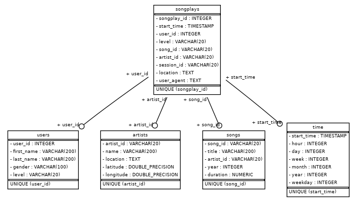

# Project summary

This is a first demo project in the Data Engineer Nanodegree Udacity program. Description of the project is given below.   

A startup called Sparkify wants to analyze the data they've been collecting on songs and user activity on their new music streaming app. The analytics team is particularly interested in understanding what songs users are listening to. Pipeline implemented in this project allows to transofrm JSON logs with user activity on the app and on the songs and load the result to Postgres database.

# Database schema

Database is designed using usual fact-dimensions tables schema also known as a star-schema. There are five tables

* artists (artist_id, name, location, latitude, longitude) represents a dimension table.
* songplays (songplay_id, start_time, user_id, level, song_id, artist_id, session_id, location, user_agent) represents a fact table. It describes the fact that particular user has listened a particular song of particular artist during particular period of time.
* songs (song_id, title, artist_id, year, duration) is a dimension table.
* time (start_time, hour, day, week, month, year, weekday) is a dimension table.
* users (user_id, first_name, last_name, gender, level) is a dimension table as well.

The schema is presented on the picture below



You can generate the above image with
```
python display_schema.py
```

# Prerequisites for ETL pipeline

In order to run the scripts you'll need python. **Python 3.7** and higher is supported. Also it's better to work in isolated environment. There are plenty of ways to isolate the
environment (virtualenv, pyenv, anaconda, .etc). One of the simplest is to create new Anaconda environment with the following commands
```
conda create --name my-env
conda activate my-env
pip install -r requirements.txt
```

**Note**: Ubuntu users might experience issues with **pg_config executable not found** error. In this case installation
```
sudo apt install libpq-dev
```
can help.

It's better to have docker installed. It would simplify a local start. Otherwise you can try to run postgres locally.

# Instructions on how to run pipeline

Run **docker-compose**. Note that for the purposes of demo password and username are specified directly in the repository. You wouldn't want to do this in real production.

```
docker-compose up
```

Then create tables with python script
```
python create_tables.py
```

Finally, run the ETL pipeline.
```
python etl.py
```

If you run this stuff with docker-compose you can now go to **localhost:8080** and after login review all your tables via postgres-adminer. Also you can easily manage your data or perform SQL queries using this simple tool.


# Testing

In order to run the test first start postgres with test database
```
docker-compose --file=docker-compose.test.yml up
```
Then run
```
pytest test_etl.py
```
Use pytest-cov to see the coverage:
```
pytest --cov=etl test_etl.py
```
Or for more detailed version of report
```
pytest --cov=etl  --cov-report=term-missing test_etl.py
```

# Code quality maintenance

To check the code quality run
```
pylint etl.py
```

# Next steps

* make ETL a console application with possibility to run the pipeline from the command line
* add possibility of bulk insert
* better test coverage

