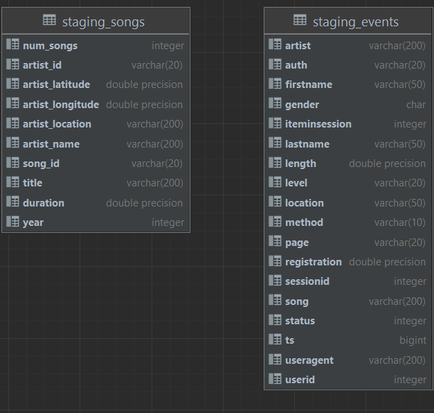
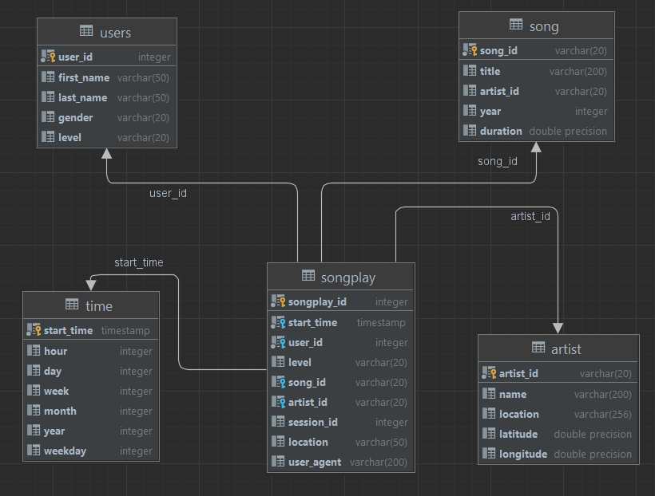

## Prerequisites

You should have python 3.7 or higher installed in order to run the scripts. Also, you should have an Amazon account with created IAM role and Redshift cluster ready to use. Make sure that cluster you've created is in the same region as the data in S3 bucket.

Create a *dwh.cfg* file in the root directory of the project with the following content (filling the placeholders with your actual values):
```
[CLUSTER]
HOST=your-cluster.XXXXXXXXX.us-west-2.redshift.amazonaws.com
DB_NAME=your-db-name
DB_USER=your-db-user
DB_PASSWORD=your-db-password
DB_PORT=5439

[IAM_ROLE]
ARN='arn:aws:iam::XXXXXXXXXXXX:role/your-role-name'

[S3]
LOG_DATA='s3://udacity-dend/log-data'
LOG_JSONPATH='s3://udacity-dend/log_json_path.json'
SONG_DATA='s3://udacity-dend/song-data'
```

## Database schema

Staging tables schema:


Final tables schema (ready for analytical queries):



It's easy to see that the final tables form a snowflake structure with fact table songplay being in the middle. All other tables are dimension tables. This schema are easy to understand and perform analytical queries on.


## ETL pipeline

Firstly, run the following command to create the tables:
```
$ python create_tables.py
```

**If the tables already exist, the script will drop them and recreate them!**

Then, run the following command to populate the tables:
```
$ python etl.py
```

This command performs the following steps:

1. Extracts the data from the source json files.
2. Stages the data in the Amazon Redshift database staging tables.
3. Loads the data from the staging tables into the final tables ready for analytical queries.

## AWS cluster setup automation

TODO

## Analytical queries

See `analytics.py` module for analytical queries.

Possible  queries:
```
$ python analytics.py most_popular_songs
$ python analytics.py most_popular_artists
$ python analytics.py most_active_users
```

## Performance benchmarks

TODO

## Code quality maintenence

Use the following command to check the code quality of the module
```
$ pylint etl.py
```